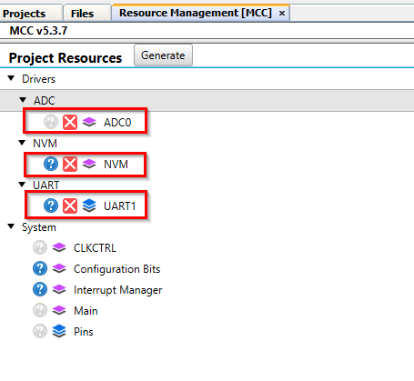
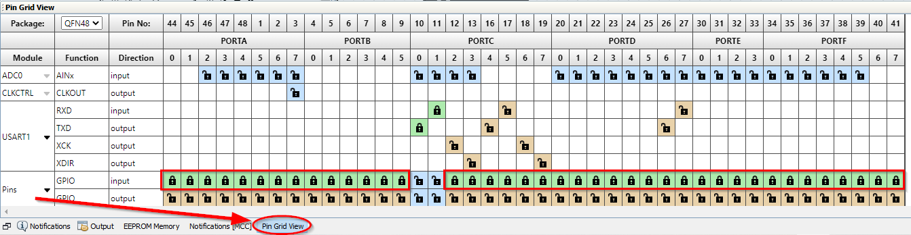
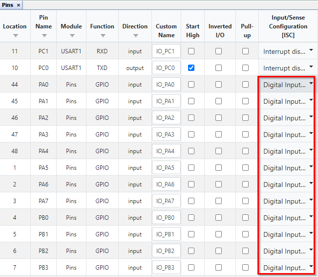
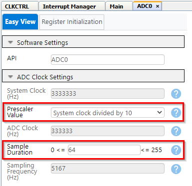
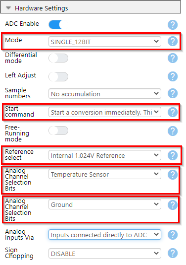
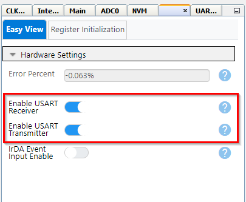
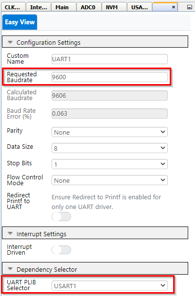
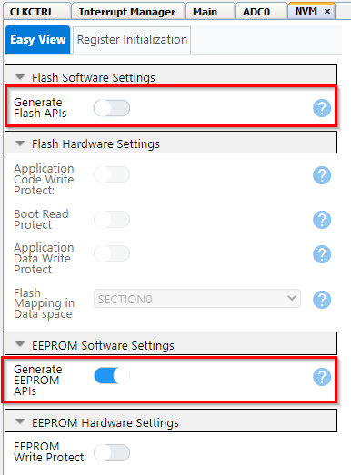
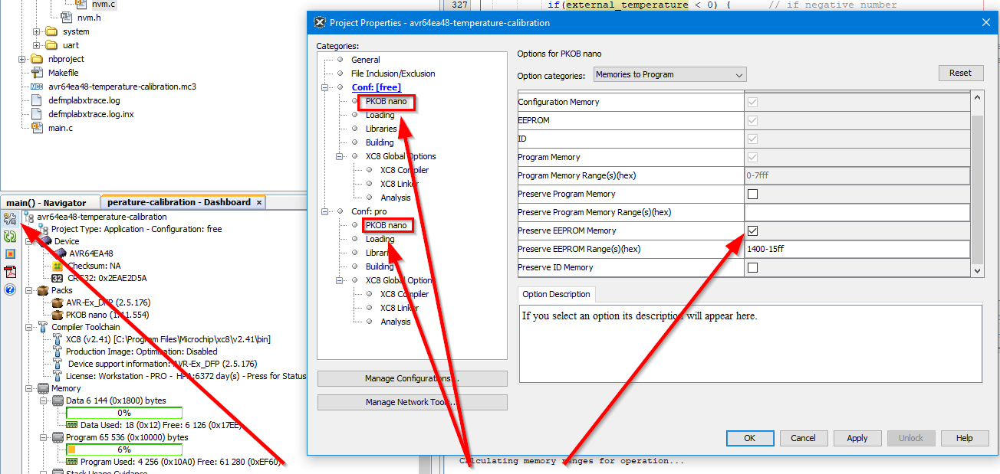
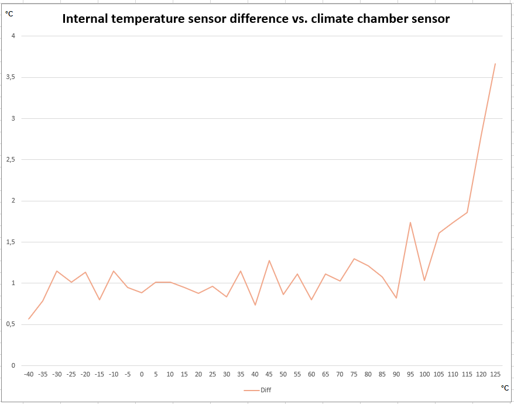

<!-- Please do not change this logo with link -->
[](https://www.microchip.com)

# Improving Internal Temperature Sensor With Customer Production Calibration Adjustment

The AVR® EA family of devices has an internal temperature sensor. The internal temperature sensor is not directly accessible, only the Analog-to-Digital Converter (ADC) peripheral can access it. The internal temperature sensor outputs a voltage signal T<sub>SENSE</sub> that is internally routed to the ADC and converted to a digital number.  

This example shows how to adjust the calibrated offset value for the internal temperature sensor in order to increase the accuracy of the internal temperature sensor for a certain temperature point (typically, it is more accurate in a smaller temperature range).  

## Related Documentation

- [AVR64EA48 device page](https://www.microchip.com/wwwproducts/en/AVR64EA48)
- [MPLAB® Code Configurator](https://www.microchip.com/en-us/development-tools-tools-and-software/embedded-software-center/mplab-code-configurator)  

## Software Used

- [MPLAB X IDE v6.10](http://www.microchip.com/mplab/mplab-x-ide) or newer
- [Microchip AVR64EA48 Device Support Pack AVR-Ex_DFP v2.5.176](https://packs.download.microchip.com/) or newer
- [MPLAB XC8 Compiler v2.41](http://www.microchip.com/mplab/compilers) or newer
- MPLAB Code Configurator (MCC)
  - [MCC Plugin v5.3.7](https://www.microchip.com/mplab/mplab-code-configurator) or newer
  - [MCC Core v5.5.7](https://www.microchip.com/mplab/mplab-code-configurator) or newer
- Pymcuprog Utility  [(pymcuprog)](https://pypi.org/project/pymcuprog/)  

## Hardware Used

- [AVR64EA48 Curiosity Nano](https://www.microchip.com/en-us/development-tool/EV66E56A)  

## Test Setup

Connect the Curiosity Nano to the PC using a USB cable. This will let you program the device using MPLAB X, but erase or write eeprom using the python program pymcuprog.  

No additional setup is needed as the temperature measurement is done internally in the device.  

## Peripherals Configuration Using MPLAB Core Configurator (MCC) Melody

Add the required peripherals: ADC0, UART1 and NVMCTRL. These are found under Drivers in the Device Resources window. Press the green "plus" sign to add to Project Resources, this will also make the peripheral show in the Builder view. 

These System peripherals are added automatically: CLKCTRL, Configuration Bits, Interrupt Manager, Main and Pins.  



### System Configuration

The system components (CLKCTRL, Configuration Bits, Interrupt Manager and Main) does not need any configuration since this example uses default settings and no interrupts. Pins need to be configured to reduce power consumption.

### System configuration: Pins Configuration

To reduce power consumption, the pin configuration needs to be set to disable the digital input buffer on unused pins. In this example, the only pins used are the USART1 pins, so the rest of the pins can be set to inputs and the disabled. Open the pin grid view and set all the unused pins to inputs as seen below. The pin grid view button is located at the bottom left of the screen.

  

Then the pins need to be configured. In the **Pins** Configuration view (located in the **System Firmware** box):

- For each pin except the USART1 pins (PC0 and PC1), set the Input/Sense Configuration (ISC) to "Digital Input Buffer Disabled"  

Note that the image do not show all the pins, and all unused pins should be configured in the same way.  

  

### Peripherals Configuration: ADC0 Configuration

In **ADC Clock Settings**:  

- Select Prescaler Value "System Clock Divided by 10"
- Sample Duration: 64

**Note:** The required minimum sample duration is given as >= 32 µs * f<SUB>CLK_ADC</SUB>. For this example the minimum sample duration is: 32 µs * 333333 Hz = 10.7 ≈ 11.

In **Hardware Settings**:  

- Turn on ADC Enable
- Set mode to "SINGLE_12BIT" (12-bit Single-Ended conversion)
- Set Start command to "Start a conversion immediatley"
- Set Reference select to "Internal 1.024V Reference"
- Set first analog channel selection bits (MUXPOS) to "Temperature Sensor"
- Set second analog channel selection bits (MUXNEG) to "Ground"  


  

### Peripherals Configuration: USART1 Configuration

We are using USART1 because the Rx and Tx pins of USART1 are accessible over the USB interface for the Curiosity Nano board. See the Curiosity Nano User Manual for more information.

In the "USART1_Peripheral" configuration:

- Turn on Enable USART Receiver
- Turn on Enable USART Transmitter  



In the "UART1" configuration:

- For Requested Baudrate write "9600"  

For the rest we use the default settings, so 8 data bits, 1 stop bit, no parity and no flow control.

- For "UART PLIB Selector" select USART1  



### Peripherals Configuration: NVMCTRL Configuration

In **Flash Software Settings**:

- Turn off Generate Flash APIs (we are only using the EEPROM)

In **EEPROM Software Settings**:

- Do nothing, default is correct and EEPROM APIs are generated  



## Operation

An external temperature reading (assumed to be accurate) will be stored in EEPROM. The code reads the external temperature and calculates a new value for temperature offset, which is then used to calculate a new calibrated temperature.  

### Preparations

- Connect the AVR6448 Curiosity Nano (Cnano) to a computer using a USB cable
- Download pymcuprog
- Clone the repository or download the zip to get the source code
- Open the project folder you want to run with MPLAB X IDE  
- Compile the code  

### Writing a New Temperature Measurement to the EEPROM

This example will use pymcuprog (see link under "Software Used") to write values to the EEPROM. The idea is that this also can be done in a production environment. This is just one example of how to do this, and does not exclude any other method as long as this value finds its way into the correct address of the EEPROM.  

This example assumes only one device is connected to the computer. If several devices are connected, the device to be programmed must be specified. To learn more about pymcuprog, see the link under "Software Used". To learn more about the pymcuprog options and arguments, use

```bash
 pymcuprog --help
```
  
In this example, we will store the temperature reading from the external temperature sensor in EEPROM addresses 33 and 34 (relatively). Address 32 will be used to indicate if a reading is stored or not. This is indicated by the data in address 32: if it is 0x5c then we assume a temperature reading is stored, if it is anything else then we assume a temperature reading has not been stored.  
  
The actual EEPROM address range for these bytes are:

- 0x001420 (0x20 = 32) - Byte indicating if temperature is stored
- 0x001421 - High byte of 16-bit temperature measurement
- 0x001422 - Low byte of 16-bit temperature measurement
  
The temperature could also be stored as an 8-bit value, a signed 8-bit integer covers -127°C to 128°C and so will cover most use cases.
  
Assuming we are measuring 23°C using the external temperature sensor at the production line, and that we want this value stored in EEPROM address 33 and 34 (EEPROM is 512 bytes and we use 2 bytes, int16_t = 16 bits = 2 bytes). Address 32 is written to 0x5c to indicate a temperature reading is done.  

```bash
 pymcuprog write -m eeprom -o 32 -l 0x5c 0x00 0x17
```  

### Running the Software

After programming the EEPROM with a temperature value, you can run the code on the AVR64EA48 and it will calculate a new offset value and store it in EEPROM. 
  
Before you program the Cnano, make sure that the EEPROM memory space is preserved during programming. Click the box marked "Preserve EEPROM memory" as indicated by the picture below. Make sure to do this for both "free" and "pro" configurations.  
  

  
It will then proceed to calculate a new temperature using the new offset value.  
  
If no new offset value is found ("empty" EEPROM bytes are read as 0xff) then the code is halted.

### Printing Result to Terminal

If USART output is enabled (include "**#define USART_on**"), the result will be printed to a terminal. Open a terminal window (Microchip Data Visualizer or your favourite terminal application). Find the serial port that the Cnano is connected to and set: baud rate to 9600, 8 bit data, no parity, no stop bit.

## Temperature Sensor

The internal temperature sensor is a Proportional to Absolute Temperature (PTAT) type, meaning it has increasing output voltage with increasing temperature.

The output voltage of the temperature sensor is linear across the temperature range. An approximation of the output voltage is presented here:  
  
V<sub>TSENSE</sub> = M<sub>V</sub> &times; T<sub>SENSE</sub> + V<sub>OFFSET</sub>  

where:  

V<sub>TSENSE</sub> = output voltage from the temperature sensor  
M<sub>V</sub> = slope of the temperature sensor output voltage (V/°C)  
V<sub>OFFSET</sub> = output voltage at T<sub>OFFSET </sub>  
T<sub>SENSE</sub> = temperature at time of measurement  
  
Due to process variations, V<sub>OFFSET</sub> and M<sub>V</sub> will be different for each device, and because of this each device must be calibrated. Solving the formula for T<sub>SENSE</sub>:
  
$$
T_{SENSE}=V_{TSENSE}-\frac{V_{OFFSET}}{M_{V}}
$$
  
While accurate, this equation requires that V<sub>OFFSET</sub> is known, but this is typically not the case. By measuring the temperature sensor voltage at a known temperature, using a nominal slope for the sensor, the temperature can be calculated using the following formula:
  
$$
T_{SENSE}=\frac{V_{TSENSE}-V_{REF}}{M_{REF}}+T_{REF}
$$
  
 where:  
  V<sub>REF</sub> = is the reference voltage of the sensor  
  M<sub>REF</sub> = slope of the temperature sensor (V / &#176;C)  
  T<sub>REF</sub> = the reference temperature  
  
If V<sub>TSENSE</sub> is expressed as ADC counts, the ADC reference voltage must be in ADC counts. M<sub>REF</sub> should also be in ADC counts per temperature to get the calculation correct.  

### Factory Calibration of the Internal Temperature Sensor

The characteristics for the temperature sensor is close to linear in the temperature range of the device and these equations are based on this fact and measurements done using the 1.024V internal reference.  
The Slope and Offset are calculated based on two measurements in production:  

- Measurement 1: ADC result RES<sub>ADC1</sub> at temperature T<sub>1</sub>
- Measurement 2: ADC result RES<sub>ADC2</sub> at temperature T<sub>2</sub>  
  
With a linear approximation the temperature is given by
  
$$
T=A \times RES_{ADC} + B = A \times (RES_{ADC} + \frac{B}{A})
$$
  
Where the temperature sensor output is increasing with increasing temperatures.  

$$
A=\frac{T_{2}-T_{1}}{RES_{ADC2}-RES_{ADC1}}
$$  

<br>  

$$
B=T_{1}-A \times RES_{ADC1}
$$

<br>

### Internal Temperature Sensor (PTAT)

The temperature sensor follows a PTAT curve, so it has increasing output voltage with increasing temperature. In this case there is no need to negate the slope:  

<br>

$$
T=A \times (RES_{ADC} + \frac{B}A)
$$  

<br>

Using a scaling factor of 4096 (12-bit DAC, 4096 = 0xfff+1) to make sure the number in the calibration register is an integer, the values to be placed in the calibration row are the following (rounded off to closest integer):

<br>

$$
Slope = 4096 \times A = 4096 \times \frac{T_{2} - T_{1}}{RES_{ADC2} - RES_{ADC1}}
$$

<br>

$$
Offset=\frac{B}A=\frac{T{1} \times (RES_{ADC2} - RES_{ADC1})}{T_{2} - T_{1}} - \frac{RES_{ADC1} \times (T_{2} - T_{1})}{T_{2} - T_{1}} =
\frac{T_{1} \times RES_{ADC2} - T_{2} \times RES_{ADC1}}{T_{2} - T_{1}}
$$

<br>

This gives the following formula for the temperature sensor:

<br>

$$
T = \frac{(RES_{ADC} + Offset) \times Slope}{4096}
$$  

<br>
  
This formula requires two calibration values to be stored in the signature row:  
  
- SIGROW.TEMPSENSE0: Internal temperature sensor slope
- SIGROW.TEMPSENSE1: Internal temperature sensor offset

<br>

### Temperature Measurement Using Factory Calibrated Values
  
An AVR64EA48 device was tested in a climate chamber to verify the accuracy of the internal temperature sensor. The temperature range was -40°C to +125°C in steps of 5°C, and each temperature step was held for 5 minutes to allow the device to adjust to the new temperature. The temperature measurements are plottet below, showing the difference between the actual temperature (the climate chamber was used as reference) and the measured temperature using the AVR64EA48 device.  

  
  
For this particular measurement it can be seen that adjusting the offset so that the temperature measurements show 1°C more, the accuracy across the range is improved. For low temperatures the difference will be -0.5°C instead of +0.5°C, while for high temperatures the difference will be 1°C less than previous, so this will also improve.

## User Calibration of the Internal Temperature Sensor

During production, the internal temperature sensor is calibrated at two temperatures, room temperature and 125°C. The measurements are taken during wafer production, and the temperatures are not expected to be uniform across the wafer. After this, the die is bonded and packaged, which is expected to make factory calibration less accurate. Since there is no measurement taken at cold temperatures, it is expected that the temperature measurements for cold temperatures will deviate more from the actual temperature in that region.  

To compensate for this, it is possible to do additional calibration of the temperature sensor to get better readings. In the following example we will show how to do a single point calibration of the device during production programming to improve the temperature sensor accuracy.  
  
### Module Configuration
  
1. Configure the voltage reference to internal 1.024V by writing to the Reference Selection (REFSEL) bit field the ADCn.CTRLC register.
2. Select the temperature sensor as input in the Positive Input Multiplexer (ADCn.MUXPOS) register.
3. Configure the ADC Sample Duration by writing a value ≥ 35 μs × f<sub>CLK_ADC</sub> to the Sample Duration (SAMPDUR) bit field in the Control E (ADCn.CTRLE) register.
4. Configure the USART to send the calculated temperature value to a terminal window for a visual representation. Note that the "#define USART_ON" must be included in the code if output to terminal is desired.

### Temperature Measurement  
  
Read the external temperature reading, stored in EEPROM. See section *Writing a new temperature measurement to the EEPROM* for information about how to add data to EEPROM. If no temperature is stored, the code execution is stopped.

```c
external_temperature = Read_External_Temperature();   // get external temperature  
if(external_temperature == 0x7fff)    // if external temperature is not stored, break
    break;
}
```

Read the factory stored values for Offset and Gain:  
  
```c
sigrow_offset = Get_Sigrow_Offset();    // get factory calibration value for offset
sigrow_gain = Get_Sigrow_Gain();    // get factory calibration value for gain
```
  
Acquire the internal temperature sensor output using the factory stored values for Offset and Gain by running a 12-bit Single-Ended ADC conversion:  
  
```c
  // read out internal temperature using factory calibration
    internal_temperature = Read_int_temp(sigrow_offset, sigrow_gain);
```
  
Now calculate a new offset value based on the previous read external temperature. By solving the formula for the temperature sensor with regards to Offset we get:  
  
$$
Offset=\frac{4096 \times T}{Slope} - RES_{ADC}  
$$
  
Using this formula, we can calculate a new offset value by using the voltage output from the internal temperature sensor (RES<sub>ADC</sub>) at a known temperature. The new offset value is stored in EEPROM, to be kept there to be used instead of the factory stored value (SIGROW.TEMPSENSE1):  
  
```c
// calculate new offset using external temperature reading
new_offset = Calculate_offset(external_temperature);
   
// write high byte of new offset to EEPROM
data = new_offset >> 8;     // note the use of uint8_t when sending signed 2 byte value,
                            // else the sign bit may be changed
nvm_status_t EEstatus = EEPROM_Write(CALCULATED_OFFSET, data);
while(EEPROM_IsBusy())
    ;

// write low byte of new offset to EEPROM
data = new_offset;
EEstatus = EEPROM_Write((CALCULATED_OFFSET + 1), data);
while(EEPROM_IsBusy())
    ;
```

The new offset is calculated in the first function called (Calculate_offset):  
  
```c  
int16_t Calculate_offset(int16_t temp)
{
    while(ADC0.STATUS)      // wait for ADC0 ready
        ;
    
    ADC0_StartConversion(ADC_MUXPOS_TEMPSENSE_gc);  // start temperature measurement    
    while(!ADC0_IsConversionDone())     // wait for conversion to complete
        ;
    
    int16_t sigrow_gain = (int16_t) SIGROW.TEMPSENSE0;    // signed gain from signature row
    uint16_t adc_reading = ADC0.RESULT;     // ADC conversion result
    
    int16_t ext_temp_K = temp + 273;        // convert temperature from Celsius to Kelvin
    // Calculate offset based on known external temperature
    float calculated_offset = ( ((float) ext_temp_K * SCALING_FACTOR) / (float) sigrow_gain ) - (float) adc_reading;
    calculated_offset += 0.5;     // add 0.5 to fix rounding errors
    calculated_offset = (int16_t) calculated_offset;        // recast value to int16_t
  
    return calculated_offset;
}
```
  
Finally, the internal temperature sensor is read again (forever, in a while(1) loop), using the new offset value. Note that there is a warning during compilation, since this value is not used for anything.

```c
while(1)
{
  if(external_temperature == 0x7fff)      // if external temperature is not stored, break
    break;

  // Now do a new temperature reading using adjusted offset 
  internal_temperature = Read_int_temp(new_offset, sigrow_gain);
}
```
  
The code does not check if a new offset is already calculated and stored in EEPROM. One way to do this is by checking for a value other than `0xffff`, since unused or erased EEPROM bytes will read `0xff`.  
  
## Summary
  
In this guide we have learned how to use an external temperature measurement to calibrate the internal temperature sensor.  
  
Writing the external temperature value to EEPROM was done using `pymcuprog`.
